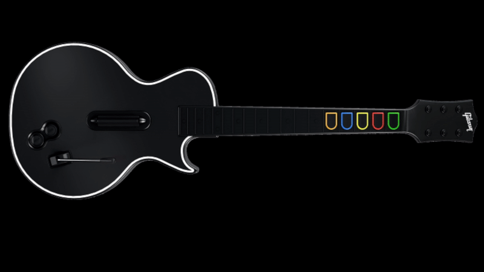

# Guitar Hero Controller OBS Overlay

A browser-based overlay for **OBS Studio** that displays a guitar controller with five colored frets (orange, blue, yellow, red, green), **strum** (up/down), **whammy bar**, and **side / alternate buttons** (minus and plus). They light up when you press the corresponding keys—ideal for streaming **Clone Hero**, **Guitar Hero**, or any game that uses the standard 5-fret keyboard layout.

## Demo

## Features

- **Live fret feedback** — Frets highlight when keys are pressed
- **Strum indicators** — Up/down strum bar lights up (Arrow Up / Arrow Down)
- **Whammy bar indicator** — Shows when whammy is held (Tab, or Alt+Gr when using the bridge)
- **Side / alternate buttons** — Minus (ESC) and plus (Enter) show as white circles when pressed
- **Works while gaming** — Keyboard bridge captures all keys globally so the overlay live updates even when your game has focus
- **OBS-ready** — Single HTML file + local Browser Source; transparent background; no external hosting / API calls
- **Standard layout** — Uses the common NBCP / Clone Hero default keys (see below)

## Requirements

- **OBS Studio** (any recent version)
- **Python 3.8+** — Required for the keyboard bridge. Install from [python.org](https://www.python.org/downloads/) (3.8 or newer). Add Python to your PATH during setup. No virtual environment needed.
- **Guitar.png** — (optional, if you want a custom Guitar skin) Place your guitar artwork in this folder (741×250 px recommended). The repo may reference this file; ensure it exists next to `index.html`.

## Quick Start

### 1. Add the overlay in OBS

1. In OBS, add a **Browser** source.
2. Check **Local file** and browse to `index.html` in this folder.
3. Set **Width** to `800` and **Height** to `600`.
4. Position and resize the source in your scene to your liking.

### 2. Run the keyboard bridge

So the overlay updates **while your game (e.g. Clone Hero) has focus**:

1. **Setup (once)** — Double-click **setup.bat** (or run it from a terminal). It installs the Python dependencies from `requirements.txt`.
2. **Start** — Double-click **start.bat** (or run it from a terminal). It starts the keyboard bridge. Keep this window open while streaming.

You should see:

- `WebSocket server on ws://127.0.0.1:16899`
- `NBCP keyboard bridge running. Press v/c/x/z/shift to test.`
- `Stop: Ctrl+C in this window.`

The small dot in the overlay (bottom-right) turns **green** when the overlay is connected to the bridge; **gray** when disconnected. To stop the bridge, press **Ctrl+C** in the bridge window.

**Windows:** If key presses are not detected (e.g. in a game), try running **start.bat** as Administrator (right‑click → Run as administrator).

## Scripts and what they do

| Item | What it is | How to use it |
|------|------------|---------------|
| **setup.bat** | One-time setup: installs the Python packages the bridge needs (`websockets`, `pynput`) from `requirements.txt`. | Double-click **setup.bat** (or run it from a terminal) once before first use. Requires **Python 3.8+** installed. |
| **start.bat** | Starts the keyboard bridge so the overlay updates while your game has focus. | Double-click **start.bat** (or run it from a terminal) when you want to record/stream. Keep the window open; press **Ctrl+C** to stop. Run **setup.bat** first if you haven’t. |
| **index.html** | The overlay page OBS displays. It draws the guitar, five frets, strum up/down, whammy bar, and side (minus/plus) indicators, and listens for key presses and WebSocket messages from the bridge. | Add it as a **Browser** source in OBS and point the source to this file. You don’t run it yourself. |
| **keyboard_bridge.py** | The Python app that captures your keyboard globally (frets, strum, whammy, side buttons) and forwards key down/up to the overlay over a local WebSocket on port 16899. | Started for you by **start.bat**. You can also run `python keyboard_bridge.py` manually after running **setup.bat** once. |
| **requirements.txt** | List of Python packages the bridge needs. | Used by **setup.bat**; you don’t need to run pip yourself. |

**Summary:** Use **index.html** in OBS as a Browser source. To have the overlay react to keys while you’re playing, run **setup.bat** once, then **start.bat** when you record/stream.

## Key bindings (default)

### Frets

| Fret   | Key   | Use case        |
|--------|--------|-----------------|
| Green  | `V`    | Lowest string   |
| Red    | `C`    |                |
| Yellow | `X`    |                |
| Blue   | `Z`    |                |
| Orange | `Shift`| Highest string  |

This matches the common **NBCP** layout used by Clone Hero and many other rhythm games. The overlay does not remap keys; change your game’s key bindings to match this if needed.

### Strumming and whammy bar

| Action       | Key             | Overlay behavior                                |
|--------------|-----------------|-------------------------------------------------|
| Strum up     | `↑` (Arrow Up)  | Strum-up indicator lights (white)              |
| Strum down   | `↓` (Arrow Down)| Strum-down indicator lights (white)            |
| Whammy bar   | `Tab`           | Whammy indicator lights (white). When using the bridge, the bridge sends whammy as **Alt+Gr** (keycode 9)—bind whammy to Alt+Gr in your game if you use the bridge. |

The **keyboard bridge** forwards strum up, strum down, whammy (Alt+Gr), and the side buttons, so all of these update on the overlay while your game has focus.

### Side / alternate buttons

| Action   | Key      | Overlay behavior                                      |
|----------|----------|--------------------------------------------------------|
| Minus    | `Esc`    | Minus (side) indicator lights—white circle, higher one |
| Plus     | `Enter`  | Plus (side) indicator lights—white circle, lower one   |

These are the two side buttons on the neck (often used for pause/menu in Clone Hero). The bridge forwards both, so they show on the overlay when your game has focus.

## OBS integration summary

| Step | Action |
|------|--------|
| Source type | **Browser** |
| Local file | Path to `index.html` |
| Dimensions | 741×250 (default); adjust in OBS as desired |
| Background | Transparent (handled in the page) |

No custom URL or server is required for the overlay itself; the bridge automatically runs a local WebSocket server on port **16899**.

## Project structure

| File | Purpose |
|------|--------|
| `setup.bat` | One-time setup: runs `pip install -r requirements.txt` to install bridge dependencies |
| `start.bat` | Starts the keyboard bridge (`keyboard_bridge.py`); keep the window open while streaming |
| `index.html` | Overlay page: guitar graphic (Guitar.png), frets, strum, whammy, side buttons; key and WebSocket handling |
| `guitar.css` | Styles for the overlay |
| `keyboard_bridge.py` | Bridge: global keyboard hook + WebSocket server; forwards frets, strum, whammy (Alt+Gr), and side buttons (Esc, Enter) |
| `requirements.txt` | Python deps for the bridge (`websockets`, `pynput`); used by setup.bat |
| `Guitar.png` | Guitar artwork (you must provide or export; 741×250 recommended) |

## Customization

- **Fret position/size** — In `index.html`, adjust the `FRET` object (e.g. `startX`, `spacing`, `top`, `width`) to match your `Guitar.png` layout.
- **Strum / whammy / side positions** — In `index.html`, adjust `STRUM_UP`, `STRUM_DOWN`, `WHAMMY`, `ALT_MINUS`, and `ALT_PLUS` (x, y in viewBox coordinates).
- **Colors** — Fret colors are set in the SVG styles in `index.html` (e.g. `.fret-green`, `.fret-red`). Strum, whammy, and side indicators use white fill when active.

## Troubleshooting

- **Frets don’t light when game has focus** — Run **start.bat** and leave the window open; ensure the overlay dot is green.
- **Bridge won’t start** — Run **setup.bat** first (once). If it still fails, install **Python 3.8 or newer** from [python.org](https://www.python.org/downloads/) and add it to your PATH, then run setup.bat again. On Windows, try running **start.bat** as Administrator (right‑click → Run as administrator).
- **Wrong keys** — The overlay uses the key bindings above. Match your game’s key bindings to these (e.g. in Clone Hero settings).

## License

This project is provided as-is for use with OBS and rhythm games. Use and modify as you like. If you redistribute it, keep attribution and this README handy for others.
